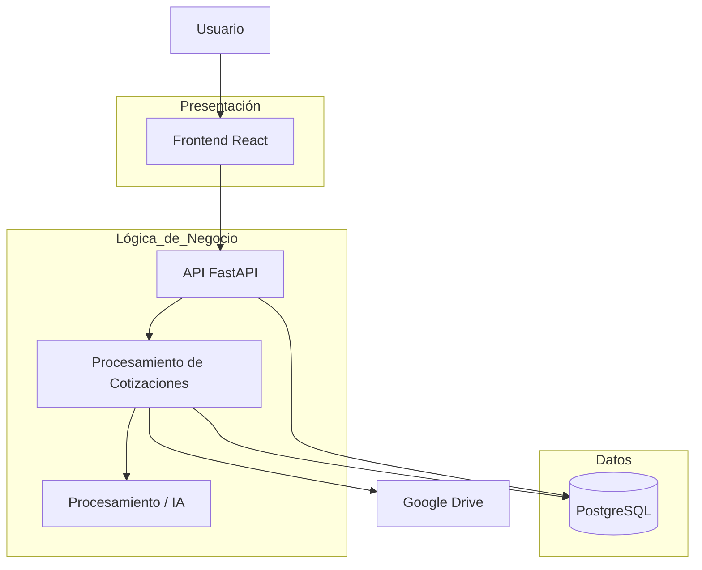

# Cotiza+

## Proyecto Capstone 2026

Proyecto desarrollado para el proceso de Título de **Ingeniería en Informática de Duoc UC, Sede Alameda**.

**Cotiza+** es una plataforma web orientada a la automatización, centralización y análisis de cotizaciones comerciales almacenadas principalmente en documentos PDF.

---

## Descripción

Actualmente, muchas cotizaciones comerciales se encuentran almacenadas como archivos PDF dentro de Google Drive, lo que dificulta la búsqueda, comparación y análisis de información relevante como:

- Cliente
- Fecha de cotización
- Productos o servicios
- Cantidades
- Precios
- Subtotales
- Totales
- Estado de la cotización

El procesamiento manual de estos documentos puede generar pérdida de tiempo, errores, duplicidad de información y dificultades para obtener métricas comerciales.

**Cotiza+** busca automatizar este proceso mediante la detección y procesamiento de cotizaciones, transformando información no estructurada proveniente de documentos PDF en datos organizados y almacenados en una base de datos.

La información posteriormente podrá ser consultada mediante una aplicación web y una API.

---

## Objetivo general

Desarrollar una plataforma que permita automatizar la extracción, almacenamiento, consulta y análisis de información proveniente de cotizaciones comerciales en formato PDF.

---

## Flujo principal del sistema

El flujo general de Cotiza+ será:

```text
Google Drive
     │
     ▼
Detección de nuevas cotizaciones PDF
     │
     ▼
Extracción de información
     │
     ▼
Validación y normalización
     │
     ▼
Control de duplicados
     │
     ▼
PostgreSQL
     │
     ▼
API REST - FastAPI
     │
     ▼
Aplicación Web - React
```

La extracción de información utilizará reglas de procesamiento y podrá utilizar inteligencia artificial como mecanismo de apoyo cuando la estructura del documento lo requiera.

---

## Tecnologías utilizadas

### Frontend

- React
- JavaScript / TypeScript
- HTML5
- CSS3

### Backend

- Python
- FastAPI
- API REST

### Base de datos

- PostgreSQL

### Integraciones

- Google Drive
- Procesamiento de documentos PDF
- Servicios de Inteligencia Artificial para apoyo en extracción de información

### Herramientas de desarrollo

- Git
- GitHub
- Visual Studio Code
- Postman

---

## Arquitectura de la solución

Cotiza+ utiliza una **arquitectura de tres capas**, separando las responsabilidades principales del sistema.

### 1. Capa de presentación

Responsable de la interacción con el usuario.

Implementada mediante:

- React
- Interfaces web
- Formularios
- Dashboard
- Visualización de cotizaciones
- Métricas comerciales

### 2. Capa de lógica de negocio

Responsable de procesar las solicitudes y aplicar las reglas del sistema.

Implementada principalmente mediante:

- Python
- FastAPI

Entre sus responsabilidades se encuentran:

- Procesamiento de cotizaciones
- Validación de información
- Normalización de datos
- Control de duplicados
- Autenticación
- Autorización mediante roles
- Comunicación con Google Drive
- Exposición de endpoints REST

### 3. Capa de datos

Responsable de almacenar y recuperar la información del sistema.

Implementada mediante:

- PostgreSQL

Permitirá almacenar información relacionada con:

- Usuarios
- Clientes
- Cotizaciones
- Productos o servicios
- Detalles de cotización
- Estados
- Historial de procesamiento

---

## Diagrama de arquitectura



---

## Metodología de trabajo

El proyecto será desarrollado utilizando la metodología ágil **Scrum**.

El trabajo se organizará mediante iteraciones o Sprints, permitiendo desarrollar y validar funcionalidades de manera progresiva.

Entre las principales actividades se consideran:

- Levantamiento y análisis de requerimientos
- Diseño de la solución
- Desarrollo frontend
- Desarrollo backend
- Diseño e implementación de base de datos
- Integración con Google Drive
- Procesamiento de documentos
- Pruebas
- Validación
- Documentación
- Entrega incremental de funcionalidades

GitHub será utilizado para el control de versiones y gestión del código fuente.

---

## Integrantes

| Integrante | Rol |
|---|---|
| Ignacio González | Integrante del equipo / Desarrollo |
| COMPLETAR | Integrante del equipo |
| COMPLETAR | Integrante del equipo |
| COMPLETAR | Integrante del equipo |

---

## Estructura del repositorio

La estructura general proyectada para Cotiza+ es:

```text
cotiza-plus/
│
├── frontend/
│   ├── src/
│   ├── public/
│   └── package.json
│
├── backend/
│   ├── app/
│   ├── routes/
│   ├── services/
│   ├── models/
│   └── requirements.txt
│
├── docs/
│   ├── diagramas/
│   ├── entregables/
│   └── evidencias/
│
├── .gitignore
├── README.md
└── LICENSE
```

> La estructura podrá modificarse durante el desarrollo del proyecto según las necesidades técnicas de la solución.

---

## Ejecución local

### Requisitos

Para ejecutar el proyecto será necesario contar con:

- Node.js
- npm
- Python 3
- PostgreSQL
- Git

---

### Clonar repositorio

```bash
git clone URL_DEL_REPOSITORIO
```

Ingresar al proyecto:

```bash
cd cotiza-plus
```

---

### Backend

Ingresar a la carpeta del backend:

```bash
cd backend
```

Crear entorno virtual:

```bash
python -m venv venv
```

Activar entorno virtual en Windows:

```bash
venv\Scripts\activate
```

Instalar dependencias:

```bash
pip install -r requirements.txt
```

Ejecutar FastAPI:

```bash
uvicorn app.main:app --reload
```

El backend estará disponible normalmente en:

```text
http://localhost:8000
```

La documentación automática de la API estará disponible en:

```text
http://localhost:8000/docs
```

---

### Frontend

Ingresar a la carpeta del frontend:

```bash
cd frontend
```

Instalar dependencias:

```bash
npm install
```

Ejecutar entorno de desarrollo:

```bash
npm run dev
```

---

## Variables de entorno

Por seguridad, las credenciales y configuraciones privadas no deben almacenarse directamente en GitHub.

Se utilizará un archivo `.env`.

Ejemplo:

```env
DATABASE_URL=
GOOGLE_CLIENT_ID=
GOOGLE_CLIENT_SECRET=
GOOGLE_DRIVE_FOLDER_ID=
SECRET_KEY=
```

Se recomienda mantener un archivo `.env.example` con las variables necesarias pero sin credenciales reales.

---

## Funcionalidades principales

Entre las funcionalidades consideradas para Cotiza+ se encuentran:

- Detección de nuevas cotizaciones.
- Lectura de documentos PDF.
- Extracción automática de información.
- Validación y normalización de datos.
- Prevención de cotizaciones duplicadas.
- Almacenamiento estructurado en PostgreSQL.
- Consulta de cotizaciones.
- Búsqueda por cliente y otros criterios.
- Dashboard de información.
- Métricas comerciales.
- Autenticación de usuarios.
- Control de acceso mediante roles.
- Integración con Google Drive.

---

## Estado del proyecto

🚧 **Proyecto actualmente en desarrollo — Capstone 2026.**

Las funcionalidades, tecnologías y arquitectura podrán evolucionar durante las distintas fases del proyecto.

---

## Licencia

Proyecto desarrollado con fines académicos para el proceso de Título de Ingeniería en Informática de Duoc UC, Sede Alameda.
